## Pregunta 1
**Enunciado**
Obtén los productos que no están descatalogados y cuyo precio unitario esté entre 10 y 50 euros, ambos incluidos. Muestra el nombre del producto y su precio redondeado a dos decimales, ordenado de mayor a menor precio.
**Consulta**
```sql
SELECT product_name AS producto, ROUND(unit_price::numeric, 2) AS precio FROM products
WHERE discontinued = 0
AND unit_price BETWEEN 10 AND 50 ORDER BY precio DESC;
```
**Resultados**
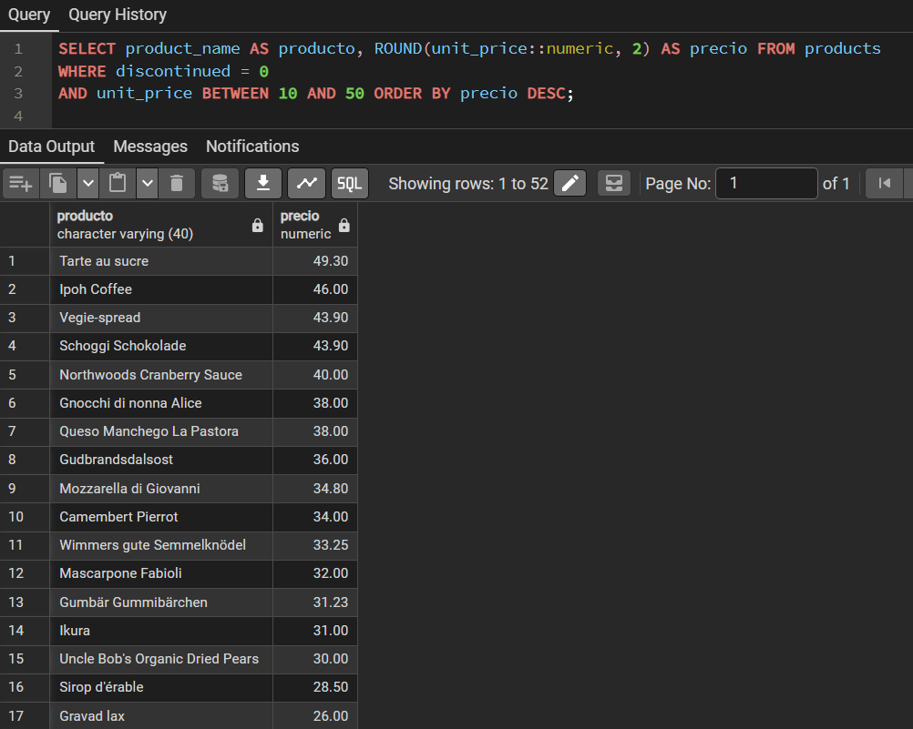
## Pregunta 2
**Enunciado**
Cuenta cuántos clientes hay en cada país y muestra únicamente aquellos países con 5 o más clientes, ordenados de mayor a menor. Indica también cuántas ciudades distintas hay en cada uno de esos países.
**Consulta**
```sql
SELECT country AS pais, COUNT(*) AS num_clientes,COUNT(DISTINCT city) AS num_ciudades
FROM customers GROUP BY country HAVING COUNT(*) >= 5 ORDER BY num_clientes DESC;
```
**Resultados**
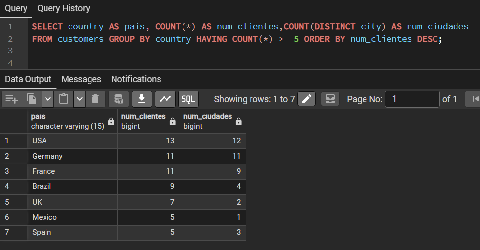
## Pregunta 3
**Enunciado**
Localiza los productos activos cuyas unidades en stock sean inferiores o iguales a su nivel de reposición. Muestra el nombre, las unidades en stock, el nivel de reposición, las unidades ya pedidas al proveedor y una columna de texto que indique 'CRÍTICO' cuando el stock sea 0 y 'AVISO' en el resto de casos.
**Consulta**
```sql
SELECT product_name AS producto, units_in_stock AS stock, reorder_level AS nivel_reposicion,
units_on_order AS pedido_a_proveedor,
CASE WHEN units_in_stock = 0 THEN 'CRÍTICO'
	ELSE 'AVISO'
	END AS situacion
FROM products
WHERE discontinued = 0 AND COALESCE(units_in_stock, 0) <= COALESCE(reorder_level, 0)
ORDER BY stock, producto;
```
**Resultados**
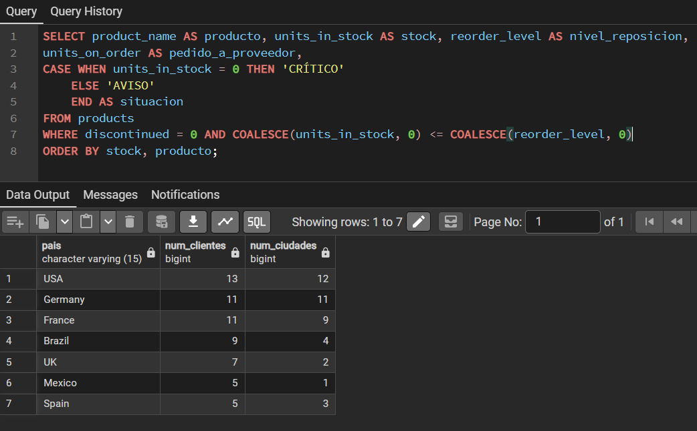
## Pregunta 4
**Enunciado**
Para los productos suministrados por empresas de Italia, Francia o España, muestra el nombre del producto, el nombre de la categoría, el nombre del proveedor, su país y su ciudad. Ordena por país y, dentro de cada país, por nombre de producto.
**Consulta**
```sql
SELECT p.product_name  AS producto, c.category_name AS categoria, s.company_name  AS proveedor,
s.country AS pais, s.city AS ciudad 
FROM products p INNER JOIN categories c ON c.category_id = p.category_id
INNER JOIN suppliers  s ON s.supplier_id = p.supplier_id
WHERE s.country IN ('Italy', 'France', 'Spain') ORDER BY s.country, p.product_name;
```
**Resultados**
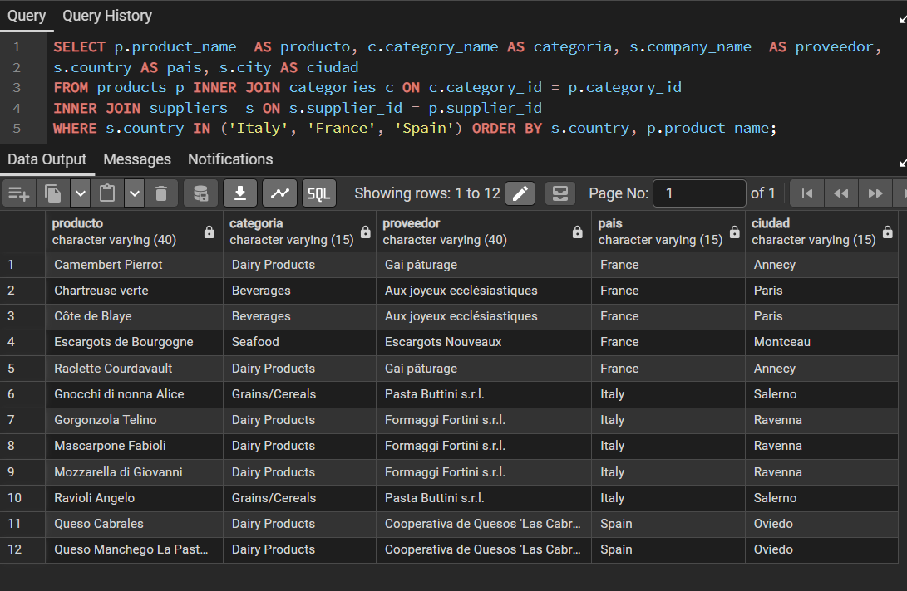
## Pregunta 5
**Enunciado**
Atención al cliente recibe una reclamación sobre el pedido **10248** y necesita reconstruir la factura línea a línea.
Muestra, para ese pedido, el nombre del producto, el precio unitario aplicado, la cantidad, el descuento y el importe final de cada línea. Añade el nombre del cliente y la fecha del pedido.
**Consulta**
```sql
SELECT cu.company_name AS cliente, o.order_date AS fecha_pedido, p.product_name AS producto,
ROUND(od.unit_price::numeric, 2) AS precio_unitario, od.quantity AS cantidad,
od.discount AS descuento,
ROUND((od.unit_price::numeric) * od.quantity * (1 - od.discount::numeric), 2) AS importe_linea
FROM orders o INNER JOIN order_details od USING (order_id)
INNER JOIN products p  USING (product_id) INNER JOIN customers cu USING (customer_id)
WHERE o.order_id = 10248 ORDER BY producto;
```
**Resultados**
 AS num_lineas,
COUNT(DISTINCT p.product_id) AS num_productos,
ROUND(SUM((od.unit_price::numeric) * od.quantity * (1 - od.discount::numeric)), 2) AS facturacion
FROM order_details od
INNER JOIN products p USING (product_id) INNER JOIN categories c USING (category_id)
GROUP BY c.category_name
HAVING SUM((od.unit_price::numeric) * od.quantity * (1 - od.discount::numeric)) > 100000
ORDER BY facturacion DESC;
```
**Resultados**
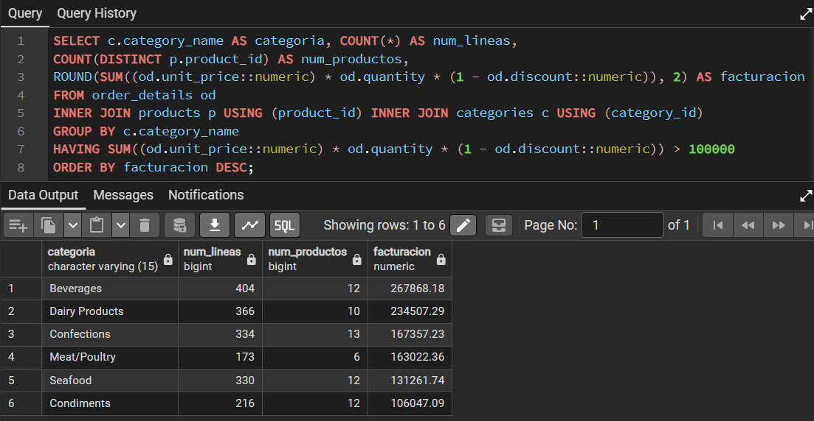
## Pregunta 7
**Enunciado**
Lista todos los clientes con el número de pedidos que ha realizado cada uno y la fecha de su último pedido. Los clientes sin ningún pedido deben aparecer igualmente, con un 0 en el conteo y el texto 'SIN PEDIDOS' en lugar de la fecha. Ordena de forma que los clientes inactivos aparezcan primero.
**Consulta**
```sql
SELECT c.company_name AS cliente, c.country AS pais, COUNT(o.order_id) AS num_pedidos,
COALESCE(MAX(o.order_date)::text, 'SIN PEDIDOS') AS ultimo_pedido FROM customers c
LEFT JOIN orders o ON o.customer_id = c.customer_id
GROUP BY c.customer_id, c.company_name, c.country ORDER BY num_pedidos ASC, cliente;
```
**Resultados**
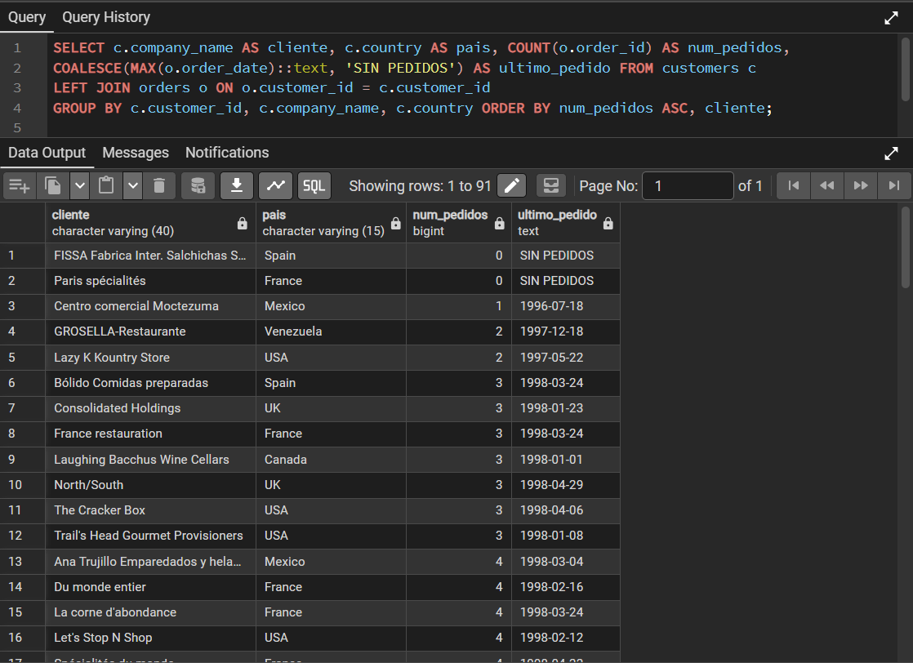
## Pregunta 8
**Enunciado**
Muestra cada empleado con su nombre completo, su cargo, el nombre completo de la persona a la que reporta y el cargo de esa persona. El empleado que no reporta a nadie debe aparecer también, con el texto 'DIRECCIÓN GENERAL' en el campo del responsable.
**Consulta**
```sql
SELECT emp.first_name || ' ' || emp.last_name AS empleado, emp.title AS cargo,
COALESCE(jefe.first_name || ' ' || jefe.last_name, 'DIRECCIÓN GENERAL') AS responsable,
COALESCE(jefe.title, 'DIRECCIÓN GENERAL') AS cargo_responsable FROM employees emp
LEFT JOIN employees jefe ON jefe.employee_id = emp.reports_to ORDER BY responsable, empleado;
```
**Resultados**
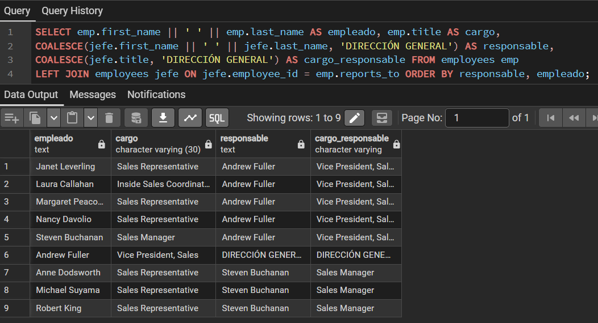
## Pregunta 9
**Enunciado**
Control de gestión quiere una rejilla completa de facturación por categoría y año, **sin huecos**: si una categoría no vendió nada en un año concreto, debe aparecer con un 0, no desaparecer de la tabla.
Genera todas las combinaciones posibles de las 8 categorías con los 3 años del histórico (24 filas) y asocia a cada combinación su facturación. Ordena por categoría y año.
**Consulta**
```sql
WITH rejilla AS (
    SELECT c.category_id, c.category_name, a.anio FROM categories c
    CROSS JOIN (VALUES (1996), (1997), (1998)) AS a(anio)
),
ventas AS (
    SELECT p.category_id, EXTRACT(YEAR FROM o.order_date)::int AS anio,
    SUM((od.unit_price::numeric) * od.quantity * (1 - od.discount::numeric)) AS facturacion
    FROM order_details od INNER JOIN products p ON p.product_id = od.product_id
    INNER JOIN orders o ON o.order_id = od.order_id
    GROUP BY p.category_id, EXTRACT(YEAR FROM o.order_date)
)
SELECT r.category_name AS categoria, r.anio AS anio, ROUND(COALESCE(v.facturacion, 0), 2)  AS facturacion
FROM rejilla r LEFT JOIN ventas v ON v.category_id = r.category_id AND v.anio = r.anio
ORDER BY categoria, anio;
```
**Resultados**
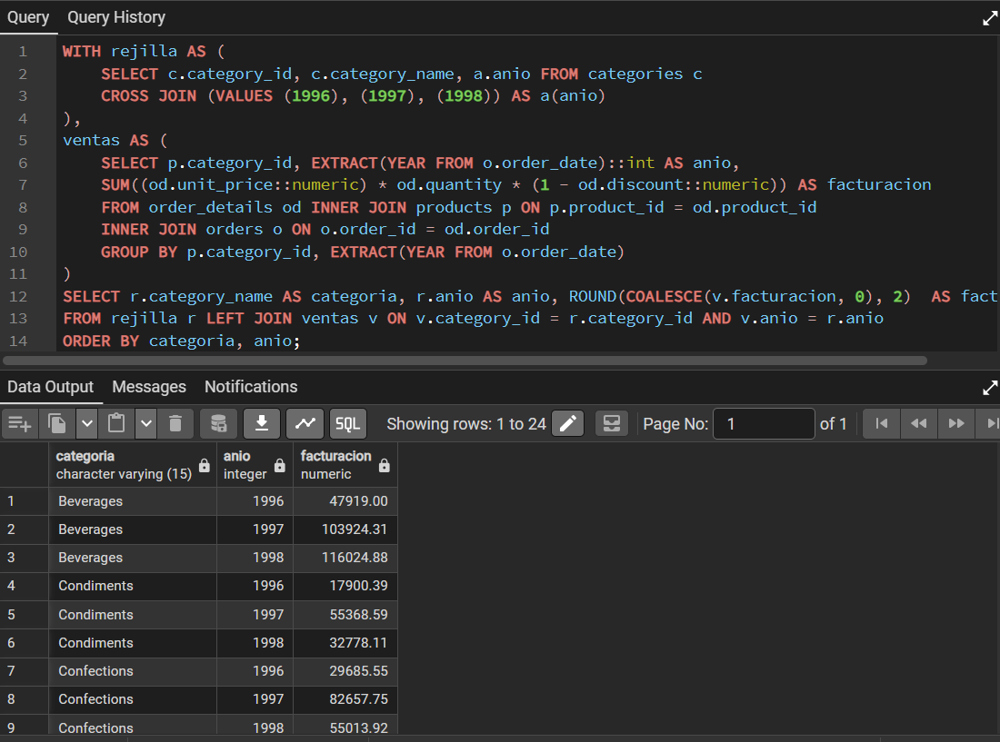
## Pregunta 10
**Enunciado**
Expansión internacional quiere una única tabla que muestre, para cada país en el que la compañía tiene presencia, cuántos clientes y cuántos proveedores hay. Deben aparecer los países que solo tienen clientes, los que solo tienen proveedores y los que tienen ambos.
**Consulta**
```sql
SELECT COALESCE(cl.pais, pr.pais) AS pais, COALESCE(cl.num_clientes, 0) AS num_clientes,
COALESCE(pr.num_proveedores, 0) AS num_proveedores,
CASE WHEN pr.pais IS NULL THEN 'SOLO CLIENTES'
	WHEN cl.pais IS NULL THEN 'SOLO PROVEEDORES'
    ELSE 'AMBOS'
END AS tipo_presencia
FROM (SELECT country AS pais, COUNT(*) AS num_clientes FROM customers GROUP BY country) cl
FULL JOIN (SELECT country AS pais, COUNT(*) AS num_proveedores FROM suppliers GROUP BY country) pr
	ON cl.pais = pr.pais ORDER BY pais;
```
**Resultados**
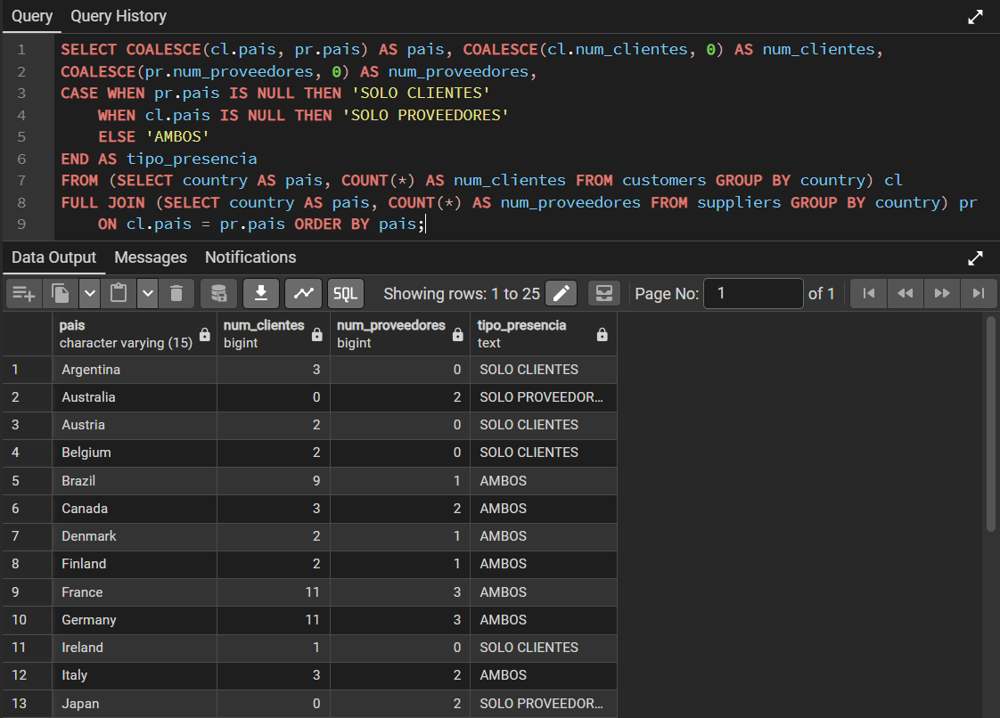
## Pregunta 11
**Enunciado**
Construye una sola tabla que reúna los contactos de clientes, los de proveedores y los empleados. Cada fila debe indicar el origen ('CLIENTE', 'PROVEEDOR', 'EMPLEADO'), el nombre de la persona de contacto en mayúsculas, la organización a la que pertenece, la ciudad y el país. Para los empleados, la organización es el literal 'NORTHWIND TRADERS' y el nombre de contacto se forma concatenando nombre y apellidos.
**Consulta**
```sql
SELECT 'CLIENTE' AS origen, UPPER(contact_name)  AS contacto, company_name AS organizacion,
city AS ciudad, country AS pais FROM customers
UNION ALL
SELECT 'PROVEEDOR', UPPER(contact_name), company_name, city, country FROM suppliers
UNION ALL
SELECT 'EMPLEADO', UPPER(first_name || ' ' || last_name), 'NORTHWIND TRADERS', city, country
FROM employees
ORDER BY origen, pais;
```
**Resultados**
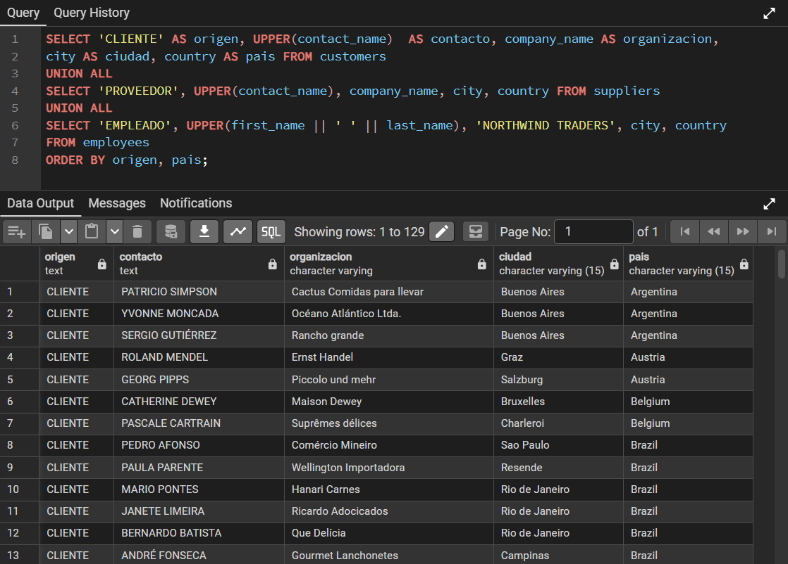
## Pregunta 12
**Enunciado**
Compras y Ventas mantienen una discusión recurrente: ¿en qué países vendemos sin tener proveedor local, y en cuáles coincidimos?
Resuelve las dos preguntas en dos consultas independientes:
**a)** Países donde hay clientes pero **ningún** proveedor.
**b)** Países donde hay **a la vez** clientes y proveedores.
Ordena ambos resultados alfabéticamente.
**Consulta**
```sql
--- Apartado A
SELECT country AS pais FROM customers
EXCEPT
SELECT country FROM suppliers ORDER BY pais;
--- Apartado B
SELECT country AS pais FROM customers
INTERSECT
SELECT country FROM suppliers ORDER BY pais;
```
**Resultados**
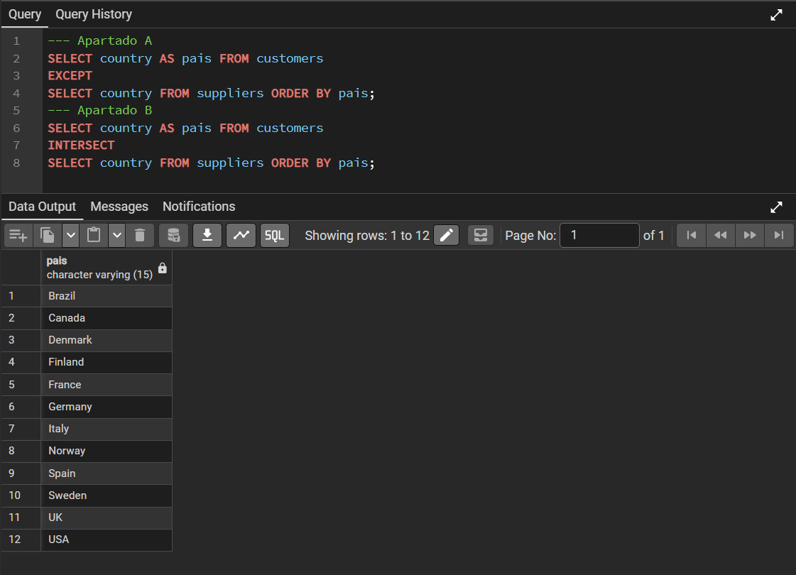
## Pregunta 13
**Enunciado**
Localiza los clientes que nunca han incluido un producto de la categoría 'Seafood' en ninguno de sus pedidos. Muestra el nombre del cliente, su país y el número total de pedidos que sí ha realizado, de mayor a menor.
**Consulta**
```sql
SELECT c.company_name AS cliente, c.country AS pais,
COUNT(DISTINCT o.order_id) AS pedidos_realizados FROM customers c
INNER JOIN orders o ON o.customer_id = c.customer_id
WHERE NOT EXISTS (
	SELECT 1 FROM orders o2
  INNER JOIN order_details od ON od.order_id = o2.order_id
  INNER JOIN products p ON p.product_id = od.product_id
  INNER JOIN categories cat ON cat.category_id = p.category_id
  WHERE o2.customer_id = c.customer_id AND cat.category_name = 'Seafood'
      )
GROUP BY c.customer_id, c.company_name, c.country
ORDER BY pedidos_realizados DESC;
```
**Resultados**
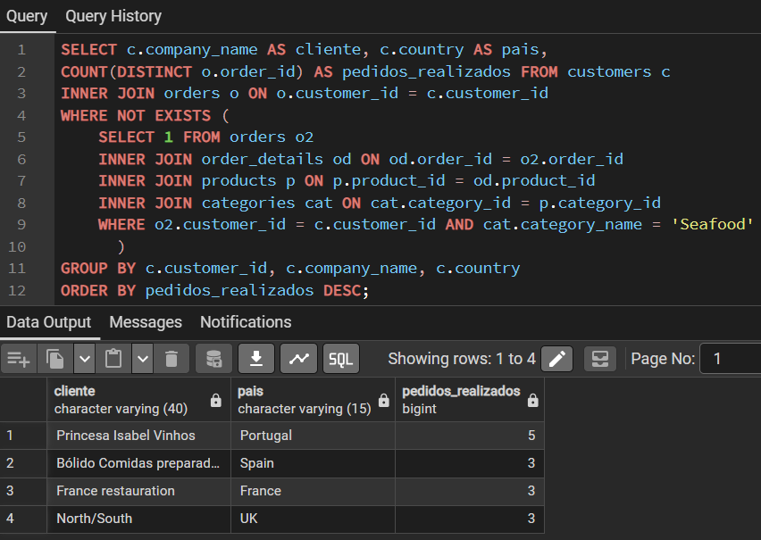
## Pregunta 14
**Enunciado**
Muestra los productos activos cuyo precio unitario supere el precio medio de todo el catálogo. Incluye en cada fila el precio del producto, el precio medio general y la diferencia entre ambos, todo redondeado a dos decimales. Ordena por diferencia descendente.
**Consulta**
```sql
SELECT product_name AS producto, ROUND(unit_price::numeric, 2) AS precio,
ROUND((SELECT AVG(unit_price::numeric) FROM products), 2) AS precio_medio_catalogo,
ROUND(unit_price::numeric - (SELECT AVG(unit_price::numeric) FROM products), 2) AS diferencia
FROM products WHERE discontinued = 0 AND unit_price::numeric > (SELECT AVG(unit_price::numeric)
FROM products) ORDER BY diferencia DESC;
```
**Resultados**
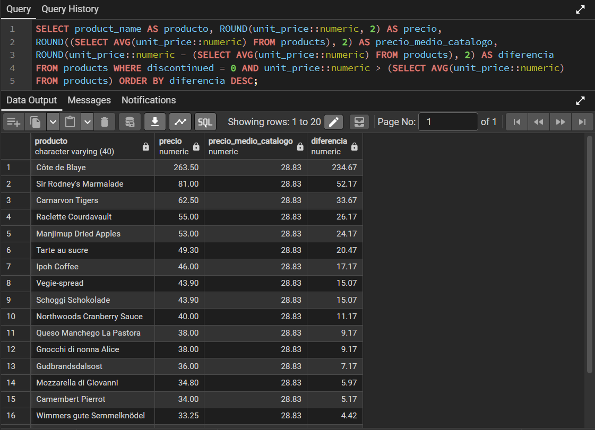
## Pregunta 15
**Enunciado**
Calcula, para cada cliente que haya comprado alguna vez, el número de pedidos, el importe total acumulado y el importe medio por pedido. Muestra los 15 clientes con mayor ticket medio.
El cálculo tiene dos niveles: primero hay que obtener el importe de cada pedido sumando sus líneas, y solo después promediar esos importes por cliente. **Promediar directamente las líneas daría un resultado distinto y equivocado.**
**Consulta**
```sql
SELECT cliente, pais, COUNT(*) AS num_pedidos,
ROUND(SUM(importe_pedido), 2) AS importe_total, ROUND(AVG(importe_pedido), 2) AS ticket_medio
FROM ( SELECT c.customer_id, c.company_name AS cliente, c.country AS pais, o.order_id,
	SUM((od.unit_price::numeric) * od.quantity * (1 - od.discount::numeric)) AS importe_pedido
    FROM customers c INNER JOIN orders o  ON o.customer_id = c.customer_id
    INNER JOIN order_details od ON od.order_id = o.order_id
    GROUP BY c.customer_id, c.company_name, c.country, o.order_id
) AS pedidos
GROUP BY customer_id, cliente, pais ORDER BY ticket_medio DESC LIMIT 15;
```
**Resultados**
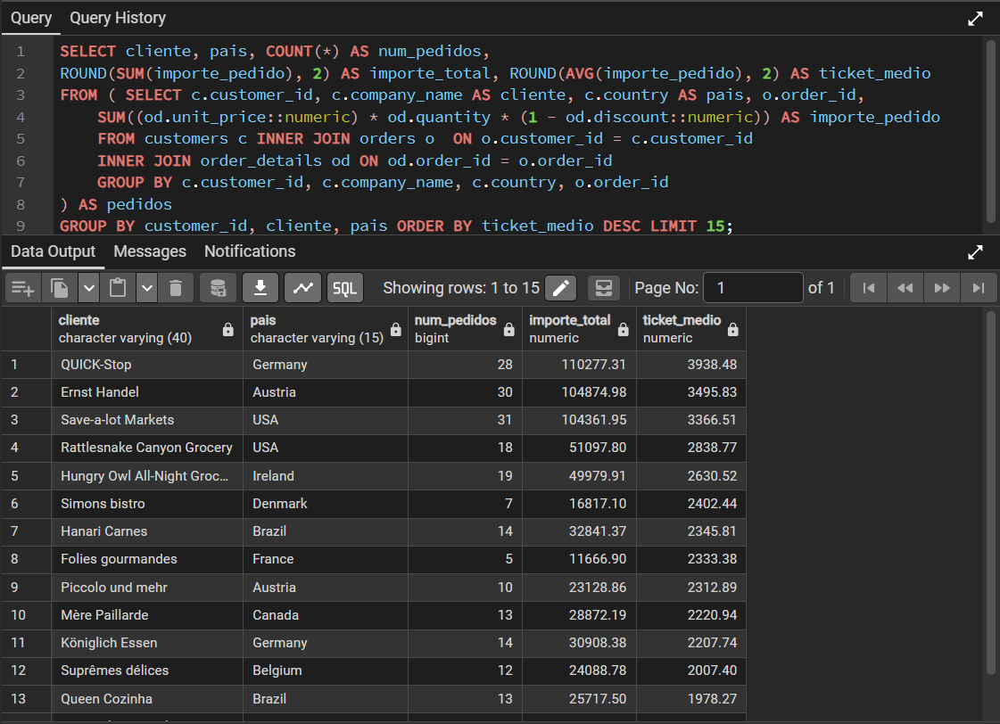
## Pregunta 16
**Enunciado**
Para cada categoría, muestra el producto con el precio unitario más alto. Incluye el nombre de la categoría, el nombre del producto, su precio y el precio medio de su categoría.
Resuélvelo con una **subconsulta correlacionada**: para cada producto, comprueba si su precio coincide con el máximo de su propia categoría.
**Consulta**
```sql
SELECT c.category_name AS categoria, p.product_name AS producto,
ROUND(p.unit_price::numeric, 2) AS precio, ROUND((SELECT AVG(p2.unit_price::numeric)
FROM products p2 WHERE p2.category_id = p.category_id), 2) AS precio_medio_categoria
FROM products p INNER JOIN categories c ON c.category_id = p.category_id
WHERE p.unit_price = (SELECT MAX(p3.unit_price) FROM products p3
WHERE p3.category_id = p.category_id) ORDER BY categoria;
```
**Resultados**
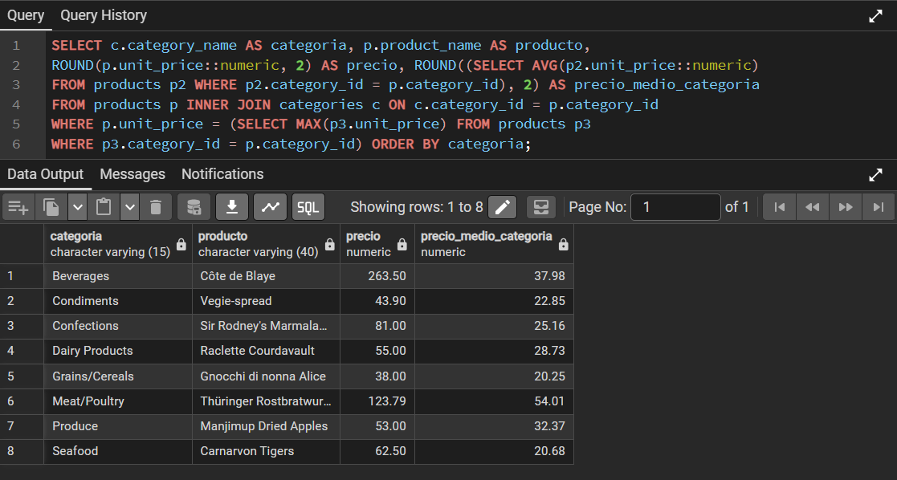
## Pregunta 17
**Enunciado**
Usando expresiones de tabla común (CTE), construye una consulta que:
1. Calcule la facturación total de cada cliente.
2. Divida los clientes en **cuartiles** según esa facturación.
3. Asigne una etiqueta de segmento: `'A - Estratégico'` al cuartil superior, `'B - Consolidado'` al segundo, `'C - Ocasional'` al tercero y `'D - Marginal'` al cuarto.
4. Devuelva, por segmento, el número de clientes, la facturación total del segmento y el porcentaje que representa sobre el total de la compañía.
**Consulta**
```sql
WITH facturacion_cliente AS (SELECT c.customer_id, c.company_name,
  SUM((od.unit_price::numeric) * od.quantity * (1 - od.discount::numeric)) AS facturacion
  FROM customers c INNER JOIN orders o ON o.customer_id = c.customer_id
  INNER JOIN order_details od ON od.order_id   = o.order_id
  GROUP BY c.customer_id, c.company_name
),
cuartiles AS ( SELECT fc.*, NTILE(4) OVER (ORDER BY fc.facturacion DESC) AS cuartil
	FROM facturacion_cliente fc
),
etiquetados AS (SELECT cu.*, CASE cu.cuartil
  WHEN 1 THEN 'A - Estratégico'
  WHEN 2 THEN 'B - Consolidado'
  WHEN 3 THEN 'C - Ocasional'
  ELSE 'D - Marginal'
  END AS segmento FROM cuartiles cu
)
SELECT segmento, COUNT(*) AS num_clientes, ROUND(SUM(facturacion), 2) AS facturacion_segmento,
ROUND(100 * SUM(facturacion) / SUM(SUM(facturacion)) OVER (), 2) AS porcentaje_sobre_total
FROM etiquetados GROUP BY segmento ORDER BY segmento;
```
**Resultados**
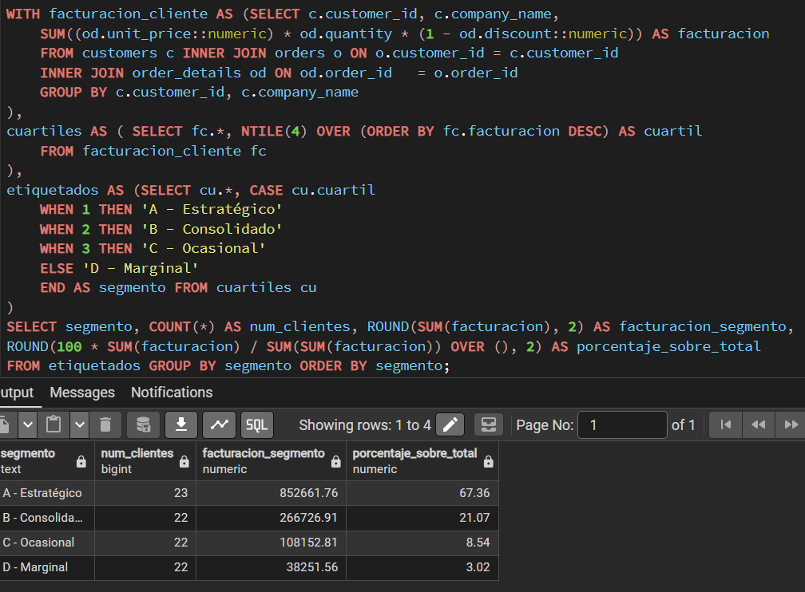
## Pregunta 18
**Enunciado**
Para cada categoría, obtén los **tres productos con mayor facturación**. Muestra la categoría, la posición dentro de la categoría, el nombre del producto, las unidades vendidas y la facturación.
Incluye además una columna con la posición global del producto en el conjunto de la compañía, para que se vea qué productos son líderes de su nicho pero irrelevantes en el total.
**Consulta**
```sql
WITH ventas_producto AS ( SELECT c.category_name, p.product_name, SUM(od.quantity) AS unidades,
	SUM((od.unit_price::numeric) * od.quantity * (1 - od.discount::numeric)) AS facturacion
  FROM order_details od INNER JOIN products p ON p.product_id  = od.product_id
  INNER JOIN categories c ON c.category_id = p.category_id GROUP BY c.category_name, p.product_name
),
rankings AS (SELECT vp.*, ROW_NUMBER() OVER (PARTITION BY vp.category_name
	ORDER BY vp.facturacion DESC) AS posicion_en_categoria,
  ROW_NUMBER() OVER (ORDER BY vp.facturacion DESC)  AS posicion_global FROM ventas_producto vp
)
SELECT category_name AS categoria, posicion_en_categoria, product_name AS producto, unidades,
ROUND(facturacion, 2) AS facturacion, posicion_global FROM rankings
WHERE posicion_en_categoria <= 3 ORDER BY categoria, posicion_en_categoria;
```
**Resultados**
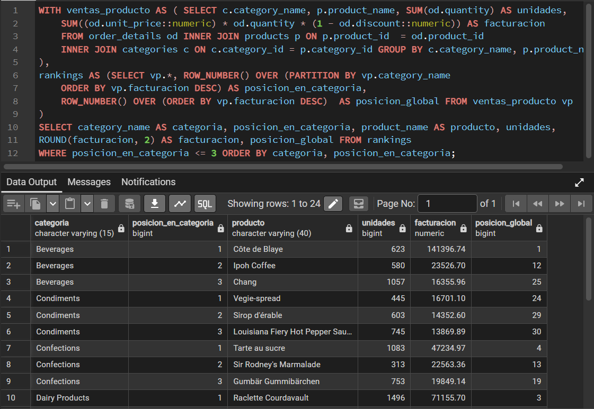
## Pregunta 19
**Enunciado**
Para cada mes de 1997, calcula:
- La facturación del mes.
- El total acumulado desde enero.
- La media móvil de los tres últimos meses (el mes actual y los dos anteriores).
- La facturación del mes anterior.
- La variación porcentual respecto al mes anterior.
**Consulta**
```sql
WITH mensual AS (SELECT DATE_TRUNC('month', o.order_date) AS mes,
	SUM((od.unit_price::numeric) * od.quantity * (1 - od.discount::numeric)) AS facturacion
	FROM orders o INNER JOIN order_details od ON od.order_id = o.order_id
	WHERE o.order_date >= DATE '1997-01-01' AND o.order_date <  DATE '1998-01-01'
	GROUP BY DATE_TRUNC('month', o.order_date)
)
SELECT TO_CHAR(mes, 'YYYY-MM') AS mes, ROUND(facturacion, 2) AS facturacion,
ROUND(SUM(facturacion) OVER (ORDER BY mes), 2) AS acumulado,
ROUND(AVG(facturacion) OVER (ORDER BY mes ROWS BETWEEN 2 PRECEDING AND CURRENT ROW), 2)
AS media_movil_3m, ROUND(LAG(facturacion) OVER (ORDER BY mes), 2) AS mes_anterior,
ROUND(100 * (facturacion - LAG(facturacion) OVER (ORDER BY mes)) / LAG(facturacion) 
OVER (ORDER BY mes), 2) AS variacion_pct FROM mensual ORDER BY mes;
```
**Resultados**
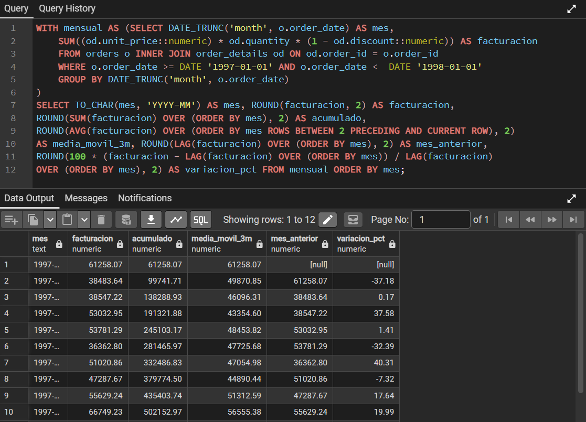
## Pregunta 20
**Enunciado**
Construye una tabla donde cada fila sea una categoría y las columnas muestren la facturación de 1996, 1997 y 1998 en columnas separadas, más el total de los tres años. Añade al final una fila de totales generales.
Incluye además una columna que indique el peso de cada categoría sobre la facturación total de la compañía, y otra que muestre si la categoría creció o decreció entre 1997 y 1998.
**Consulta**
```sql
WITH lineas AS (
    SELECT c.category_name,
           EXTRACT(YEAR FROM o.order_date)::int AS anio,
           (od.unit_price::numeric) * od.quantity
               * (1 - od.discount::numeric) AS importe
    FROM order_details od
    INNER JOIN products   p ON p.product_id  = od.product_id
    INNER JOIN categories c ON c.category_id = p.category_id
    INNER JOIN orders     o ON o.order_id    = od.order_id
),
resumen AS (
    SELECT GROUPING(category_name)                   AS es_total,
           COALESCE(category_name, 'TOTAL GENERAL')  AS categoria,
           ROUND(COALESCE(SUM(importe) FILTER (WHERE anio = 1996), 0), 2) AS f_1996,
           ROUND(COALESCE(SUM(importe) FILTER (WHERE anio = 1997), 0), 2) AS f_1997,
           ROUND(COALESCE(SUM(importe) FILTER (WHERE anio = 1998), 0), 2) AS f_1998,
           ROUND(SUM(importe), 2)                                         AS total
    FROM lineas
    GROUP BY ROLLUP (category_name)
)
SELECT categoria,
       f_1996,
       f_1997,
       f_1998,
       total,
       ROUND(100 * total
             / SUM(total) FILTER (WHERE es_total = 0) OVER (), 2) AS peso_pct,
       -- 1996 solo tiene datos desde julio y 1998 termina en mayo, así que la
       -- comparación 1997-1998 no es homogénea: mide medio año contra uno entero.
       CASE WHEN f_1998 > f_1997 THEN 'CRECE'
            WHEN f_1998 < f_1997 THEN 'DECRECE'
            ELSE 'IGUAL'
       END AS tendencia
FROM resumen
ORDER BY es_total, total DESC;
```
**Resultados**
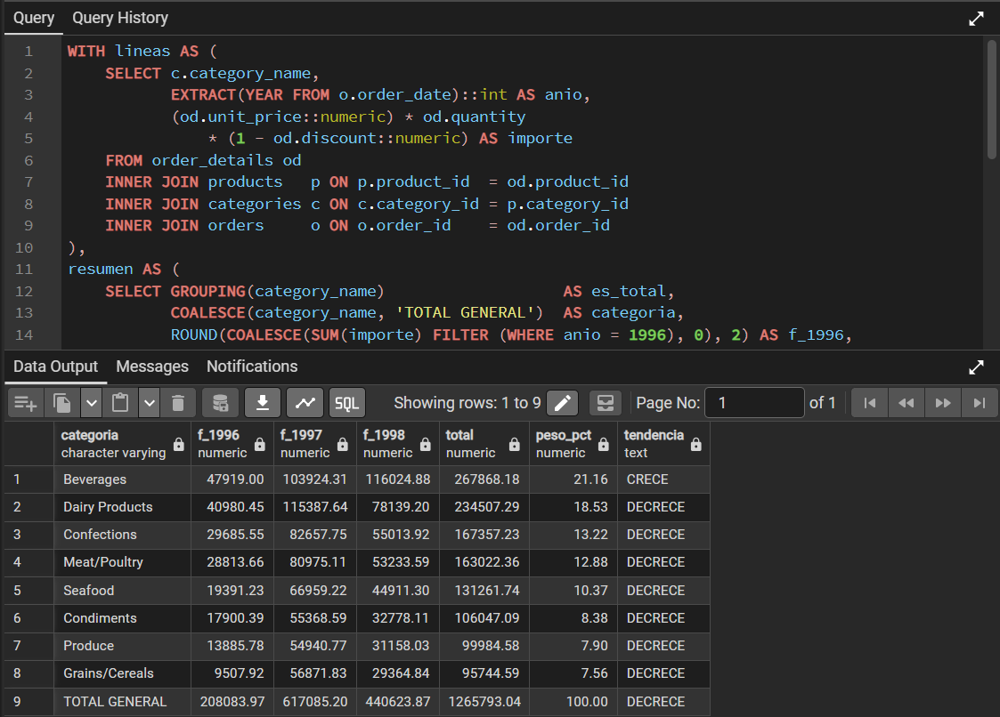
